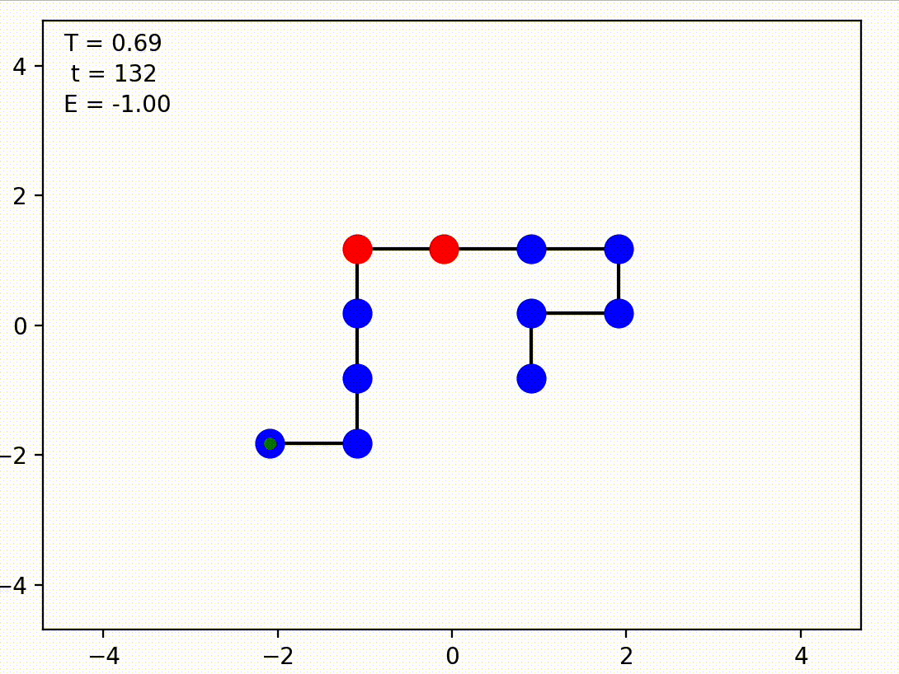

# Protein Folding Prediction using T5FoldNet

This project aims to predict the tertirary folding configuration of proteins based on their amino acid sequences using a Transformer model, specifically the T5 (Text-To-Text Transfer Transformer).

## Model Description

The model utilized in this project is a fine-tuned T5-small model. T5 is built upon the Transformer architecture, which has shown state-of-the-art performance across a variety of NLP tasks. In this project, the model is trained to generate a matrix representing the folding configuration of a given protein sequence.

## Dataset

The dataset contains over 600,000 rows of data, with each row representing a protein. The data is split into training and evaluation sets at a ratio of 80:20.

## Input

The input to the model is a string representing the amino acid sequence of a protein. The sequence is tokenized using the T5 tokenizer before being fed into the model. Each amino acid in the sequence is represented as a one-hot encoded vector, where each vector has a dimension of n, and n is the number of unique amino acids. In the one-hot encoding, the position corresponding to the specific amino acid is set to 1 (H), while all other positions are set to 0 (P).

Example Input: `H P P H P P P P H P P P ->  1 0 0 1 0 0 0 0 1 0 0 0 `

## Output

The model generates a matrix representing the folding configuration of the protein. Each row in the matrix corresponds to a particular configuration. The configurations are also one-hot encoded, similar to the input sequences.

Example Output: `[0 1 0 -1 0 0 1 0][0 0 1 0 1 1 0 -1]`

The 2D array represents the conformation of a protein in a lattice. Each column is a vector that represents a step from the current position to the next. For example, [0, 1] represents a step upwards, [0, -1] represents a step downwards, [1, 0] represents a step to the right, and [-1, 0] represents a step to the left.

Here's how to interpret the output:
- The first step is [0, 0], which means the protein stays at the same position.
- The second step is [1, 0], which means the protein moves to the right.
- The third step is [0, 1], which means the protein moves upwards.
- The fourth step is [-1, 0], which means the protein moves to the left.

The model is hosted <a href="https://huggingface.co/gespitia1/T5FoldNet">here</a>

To plot the output, simply use the HPShow helper function found in this <a href = "https://github.com/espitia01/HPSampler">repository</a>
## Post-processing

To improve the accuracy of the model's predictions, several post-processing steps can be considered:

1. **Thresholding**: Apply a threshold to the generated values to classify the configurations into distinct categories.
3. **Clustering**: Cluster similar configurations together to identify common folding patterns.

## Limitations

Currently the model is limited as it only has been trained for one epoch in a dataset that samples the conformal space for proteins of length 4 - 8. 

The notebook requires some files not hosted here to run properly. These can be accessed <a href="https://console.paperspace.com/tnj3viogvt/notebook/rmxfpdja9epzk2e">here.</a> 

### Currently Working On

<ol>
  <li>Generating a dataset that samples the space of longer sequences</li>
  <li>Further fine tune the model on the generated dataset</li>
  <li>Evaluate its performance relative and implement postprocessing on the output if necessary</li>
  <li>Compare to existing models.</li>
</ol>

